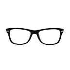
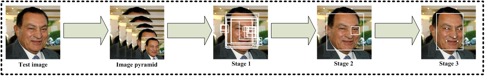
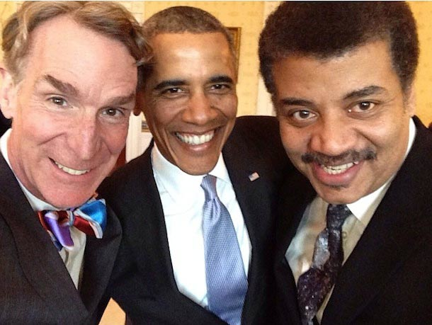
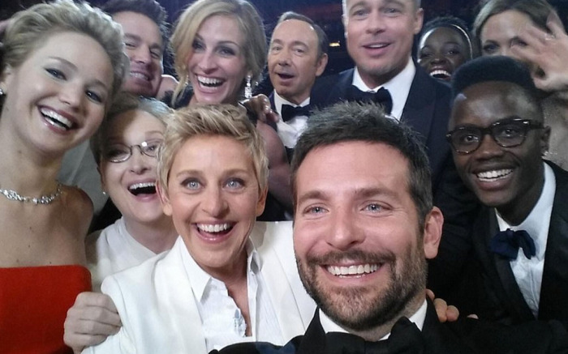

Image composition
-----------------

We are discussed work on using the Homographynet work and the Spatial
Transformer network towards achieving our goal of effectively splicing
the donor image ROI into the recipient image in previous reports. In
this report we continue discussing our development of the network
architecture and this training regime and hyper-parameter optimization.

With a focus on visual category of people in images we explore the
ability of our spatial transform network to compute an effective
homography for ‘glasses’ onto ‘human faces’. We have worked with face
images in the past so the CelebA dataset makes sense as a training set.
We focus on the cropped and aligned subset of faces from CelebA. This
constraint of pose obviously will be a problem with unconstrained face
images in the wild during testing, however, it will allow us to build
the network to handle (a) Scale; (b) Rotation; (c) and Translation
parameters. We will augment the network with pose variation to extend
the network to train on (d) Shear and (e) Projective parameters. Results
use the following sample of human face and glasses. The glasses image is
manually segmented. With development of image segmentation the donor
image will be algorithmicaly acquired from donor images in the wild.

{width="1.4645833333333333in"
height="2.1590277777777778in"}{width="1.5006944444444446in"
height="2.1951388888888888in"}

Some preliminary results from our work on splicing 'glasses' onto
'faces':

The first image is 'input', both face and the glasses are displayed with
the glasses at their 'initial' position, scale, and rotation. The second
image is the 'output', the glasses have been warped onto their 'correct'
position onto the face.

{width="1.5in" height="1.5in"}

I've used my face, which is not part of the celebA dataset. It is also
not equivalent to the cropped+aligned+centered faces that are used in
the training of the GAN. Actually, this divergence in the test sample
(my face) from the entire corpus of training images is reflected in some
results where the glasses are bizarrely warped.

The failure of such a scenario:

{width="1.5in" height="1.5in"}

In this failure case, the discriminator (part of GAN) seems to show is
limitations. Since, its trained for celebA cropped and aligned faces, it
can happen that a 'variation' in the input data falls in the 'dark zone'
of the parameter space. In other words, the discriminator has never seen
sufficient training data for this space and essentially makes a 'guess',
an extrapolation. Such extrapolation can lead to divergence in the
feedback to the affine transform parameters (scale, rotation,
translation). Hence, the glasses are erroneously warped.

Faces in the wild
-----------------

We extended our approach to function with faces in the wild, i.e.
unconstrained faces in terms of number of faces in the recipient image
and their pose. Naturally this requires detection of face(s) in the
recipient image. We incorporated Multi-Task Cascaded Convolutional
Networks (MTCNN) towards this task. Our aim was to extract a
bounding-box of the faces such that the face is correlated to the
cropped and aligned faces of CelebA dataset used in training the spatial
transform GAN. Obviously, the faces in the will not be aligned and this
will be an issue we will progressively resolve.

### Face detection

Face detection and alignment in unconstrained environment are
challenging due to various poses, illuminations and occlusions. Recent
studies show that deep learning approaches can achieve impressive
performance on these two tasks.

{width="6.925694444444445in"
height="1.4118055555555555in"}

The MTCNN is a deep cascaded multi-task framework which exploits the
inherent correlation between detection and alignment to boost up their
performance. In particular, it leverages a cascaded architecture with
three stages of carefully designed deep convolutional networks to
predict face and landmark location in a coarse-to-fine manner. The
results of the network depend on consistent facial landmarks and the
consequent bounding box is a subset of the actual face. For the moment
we simply extend the bounding box proportionally to human facial
dimensions, assuming that detected faces are reasonably oriented, i.e.
the person in generally upright in the image.

### Glasses on Faces

In our sample images we typically have multiple people, each with
different orientations. We detect the face and utilize the cropped image
with our spatial transformer GAN to splice the glasses onto the face.
The resulting face with glasses is reinserted into the test recipient
image. Some results using multiple faces and multiple glasses are shown
below:

{width="2.7805555555555554in"
height="2.092361111111111in"}

{width="3.2493055555555554in"
height="2.0284722222222222in"}
